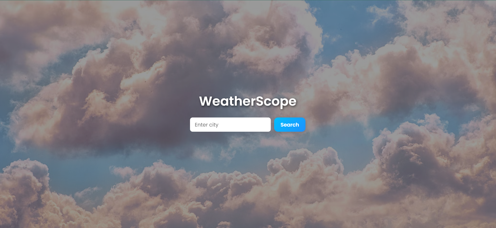

# 🌤️ Weather App

A simple and responsive Weather App built with HTML, CSS, and JavaScript that fetches real-time weather data using the OpenWeatherMap API.

## 📹 Video Demo
[Watch on LinkedIn](https://www.linkedin.com/posts/dhruv-sharma-25822228a_weatherapp-javascriptproject-frontenddevelopment-activity-7328034514616651776-t4_g?utm_source=share&utm_medium=member_desktop&rcm=ACoAAEYn6OQBWH40HzzEtatmhkNByzOSECexY-I)

## 🔧 Features
- Real-time weather data
- Location-based weather search
- Responsive UI for all screen sizes

📸 Screenshot

